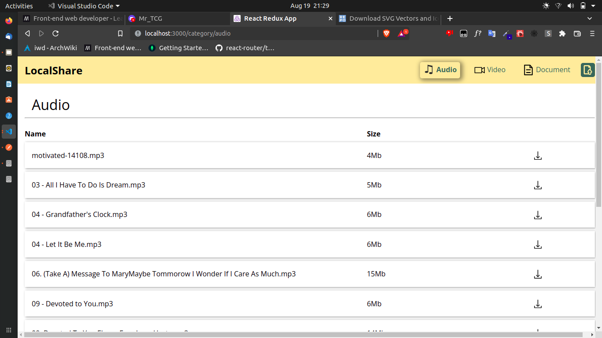

# LocalShare 
Share files between devices connected on the same wifi network from your browser.
## Image on Desktop


## Running the project locally
### Requirements
- you must have mongodb installed **locally**
### Setting things up
- clone the repo `git clone https://github.com/MikeyOnyedika/localShare.git`
- connect your computer to your home network (wifi).
- install dependencies, `npm i` on both `frontend` and `backend` folders
- edit the `.env` file in the `backend` folder to configure things like storage path for the files
- start the servers, `npm start` on both `frontend` and `backend` folders
- to access on another device, open the browser on that device and type in the ip address (printed in the backend console) and the port on the frontend
- you can now share files between computer and mobile from your browser!!

## Notes
### Rename a Git branch
```bash
# make sure you're on the branch you want to rename
git checkout master

# rename from 'master' to 'main'
git branch -m master main

# list all git branches both local and remote to confirm the change
git branch -a
```

